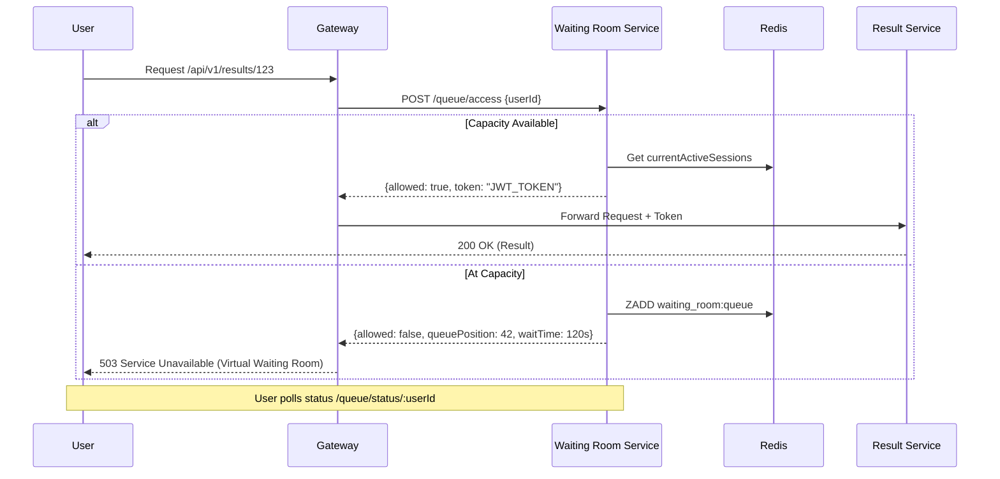

# ResultShield - Phase 5: Virtual Waiting Room

## 🎯 Phase 5 Goals
✅ Prevent system overload via queue-based access control  
✅ FIFO ordering using Redis sorted sets  
✅ JWT-based temporary access tokens  
✅ Gateway-level integration  
✅ Graceful degradation if Redis/Waiting Room fails  

---

## 🏗️ Architecture & Flow

### System Flow

---

## 🚀 Components

### 1. Waiting Room Service
Located at `services/waiting-room`.
- **queueRepository**: Direct Redis interaction (Sorted Sets for FIFO).
- **accessController**: JWT token generation and verification.
- **queueService**: High-level logic for session management and wait time calculation.

### 2. API Gateway Integration
- **waitingRoomMiddleware**: Intercepts all incoming requests.
- **Fail-safe**: If the waiting room service is unavailable, it permits requests (Fail Open) to avoid a total system outage, logging the degradation.

---

## 📊 Metrics
The service exposes metrics via `http://localhost:8001/metrics`:
- `waiting_room_users_queued_total`
- `waiting_room_queue_access_granted_total`
- `waiting_room_immediate_access_granted_total`
- `waiting_room_sessions_released_total`

---

## 🔧 Configuration

### Environment Variables (Waiting Room)
- `MAX_ACTIVE_SESSIONS`: Maximum concurrent users allowed (Default: 500).
- `THROUGHPUT_PER_SECOND`: How many users to pop from queue per second (Default: 50).
- `TOKEN_EXPIRY`: How long a user has access (Default: 5m).

### Testing the Queue
1. Set `MAX_ACTIVE_SESSIONS=1` in `docker-compose.yml`.
2. Open two different browsers (or use two different `X-User-ID` headers).
3. The second user will receive a `503` with `waiting_room: true`.

---

## 📝 Next Steps
After Phase 5 is stable, we move to **Phase 6: Observability** to visualize the queue length and wait times in Grafana.
