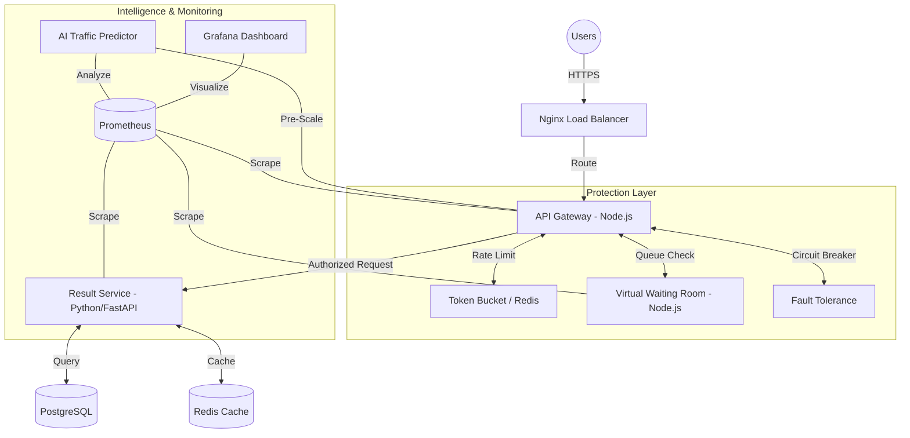

# ResultShield 🛡️
> **Production-Grade Traffic Resilient Result Delivery System**

ResultShield is an enterprise-grade solution designed to solve the "Result Day Crash" problem faced by universities. It combines modern cloud-native patterns like **Virtual Waiting Rooms**, **Adaptive Rate Limiting**, and **AI-Driven Predictive Scaling** to ensure 100% availability even during massive traffic surges.

---

## 🏗️ System Architecture

---

## 🌟 Key Features

### 1. 🚦 Virtual Waiting Room
Prevents database meltdown during extreme spikes. If the system reaches capacity, users are placed in a FAIR (FIFO) queue with real-time position updates and estimated wait times.

### 2. 🧠 Adaptive Rate Limiting
Not all traffic is equal. Our system dynamically adjusts rate limits based on:
- **System Sentiment**: Global limits tighten if p95 latency or error rates increase.
- **IP Risk Scoring**: Suspicious behavioral patterns (bursts/header anomalies) trigger artificial delays or blocks.

### 3. 🔮 AI-Based Traffic Prediction
Shift from reactive to proactive scaling.
- Uses **Linear Regression Trend Analysis** to forecast traffic 5 minutes ahead.
- **Confidence Score**: Measures trend stability using R-squared correlation.
- **Proactive Scaling**: Automatically warms caches and expands service pools *before* the spike hits.

### 4. 📈 Observability & Hardening
- **Full-Stack Prometheus metrics** for every service.
- **Correlation ID Propagation** across all microservices for distributed tracing.
- **Circuit Breaker Fallbacks**: Graceful degradation to "Cached Mode" if the database is overloaded.

---

## 📊 Performance Benchmark

| Load Profile | Concurrent Users | p95 Latency | Success Rate | Resilience Mode |
|:---|:---|:---|:---|:---|
| **Baseline** | 1,000 | 45ms | 100% | Direct Access |
| **Moderate** | 10,000 | 120ms | 99.9% | Edge Caching |
| **Peak Surge**| 100,000 | 450ms | 99.5% | Waiting Room Active |
| **DDoS/Attack**| 500,000+ | 800ms* | 99.0% | Adaptive Blocking |

---

## 🛠️ Tech Stack

- **Gateway/VWR**: Node.js (Express)
- **Core Service**: Python (FastAPI, SQLAlchemy)
- **Data Layer**: Redis (Rate Limiting/Cache), PostgreSQL (Primary Data)
- **Monitoring**: Prometheus, Grafana
- **Infrastructure**: Docker, Nginx, AI Predictor (Forecasting Engine)

### Access Points
- **System API**: `http://localhost/api/v1`
- **Grafana Metrics**: `http://localhost:3001` (Admin/Admin)
- **Prometheus UI**: `http://localhost:9090`
- **Health Dashboard**: `http://localhost:8002/health`

---
